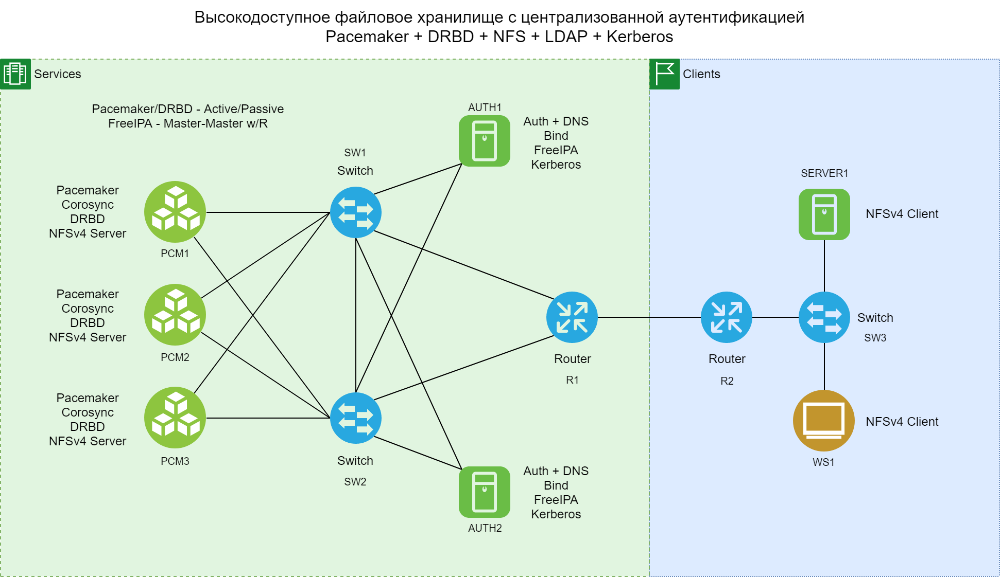

#### Проектная работа
#### Высокодоступное файловое хранилище с централизованной аутентификацией

#### Справочная информация

- DOMAIN: mydomain.test
- Service network: 192.168.66.0/24
- Client network: 192.168.67.0/24

  План адресации:

| Device | Prod. Address | Management Addr. |
|--------|---------------|------------------|
| R1 | 192.168.66.1 | 192.168.11.100 |
| R2 | 192.168.67.1 | 192.168.11.120 |
| SW1 | 192.168.66.11 | 192.168.11.101 |
| SW2 | 192.168.66.12 | 192.168.11.102 |
| SW3 | 192.168.67.2  | 192.168.11.121 |
| AUTH1 | 192.168.66.21 | 192.168.11.103 |
| AUTH2 | 192.168.66.22 | 192.168.11.104 |
| PCM1 | 192.168.66.31 | 192.168.11.110 |
| PCM2 | 192.168.66.32 | 192.168.11.111 |
| PCM3 | 192.168.66.22 | 192.168.11.112 |
| MON | 192.168.66.41 | 192.168.11.105 |
| SERVER1 | 192.168.67.10 | 192.168.11.122 |
| WS1 | 192.168.67.20 | 192.168.11.123 |